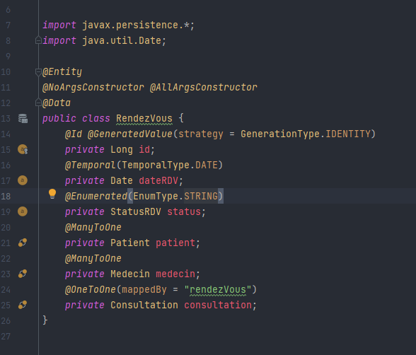
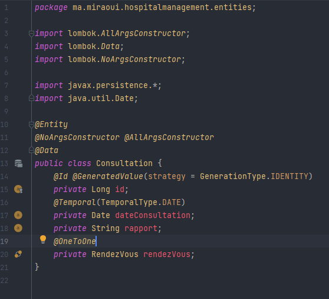
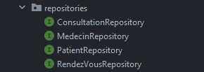
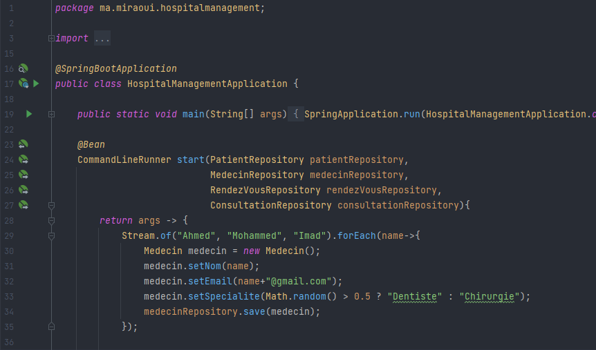
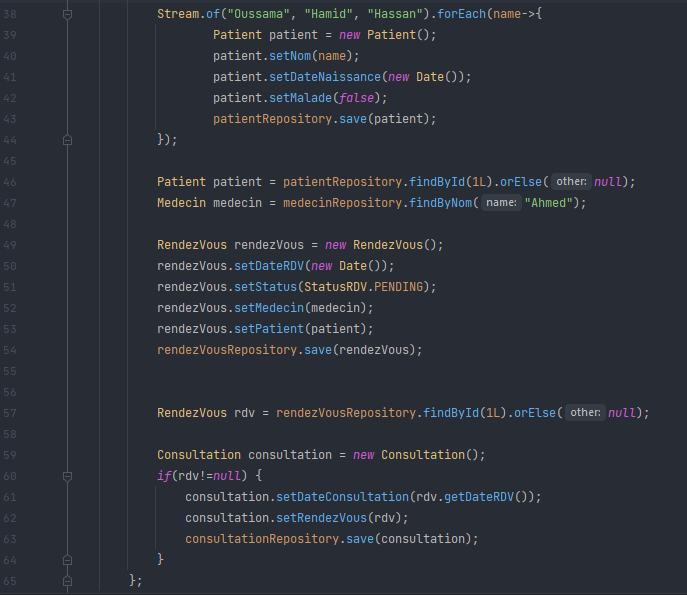

<h3>Compte rendu</h3>
<h4>Creating entities with relationships (using Annotations)</h4>
<h5>Patient entity: </h5>

<h5>Rdv entity: </h5>

<h5>Consultation entity: </h5>

<h5>Creating repositories interfaces that extends JPARepository: </h5>

<h5>Testing different Spring Data methods: </h5>

